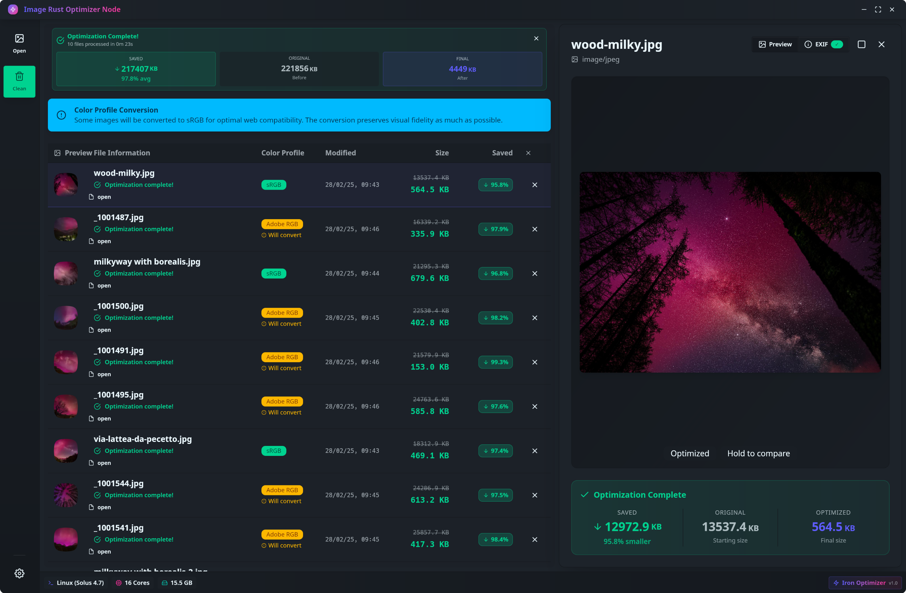

# Iron - Image Rust Optimizer


[](https://opensource.org/licenses/MIT)
[](https://www.rust-lang.org/)



**Iron** is a high-performance, cross-platform desktop application for optimizing web images. Built with a **Rust** backend and a reactive **SolidJS** frontend on top of **Tauri**, it delivers a native, secure, and blazingly fast experience.

---

## Key Features

- **Multi-Format Input** - JPEG and PNG support with optimized decoders
- **Smart Image Resizing** - Multiple presets (4K, 2K, Full HD, HD, SD) with aspect ratio preservation
- **Multi-Format Export** - WebP, JPEG, and PNG with configurable compression profiles
- **Parallel Processing** - Hardware-adaptive work-stealing algorithm using Rayon
- **Real-time Preview** - Before/after comparison with live statistics
- **Batch Operations** - Process hundreds of images simultaneously
- **Drag & Drop** - Intuitive file and folder support
- **Cross-platform** - Windows, macOS, and Linux support


---

## Architecture & Performance

Iron's core is engineered for maximum efficiency and scalability, leveraging advanced concurrency and parallelism patterns native to Rust.

### 🚀 Hardware-Adaptive Parallelism with Rayon

The optimization pipeline isn't just concurrent—it dynamically adapts to the underlying hardware.

- **Work-Stealing Scheduler**: Instead of a sequential or rigid chunked approach, Iron uses **Rayon's** parallel iterator (`par_iter`). This implements an efficient work-stealing scheduler where a thread pool—sized according to the logical CPU cores—dynamically pulls from a global task queue. As soon as a core completes an operation, it "steals" the next available task, ensuring near-100% CPU utilization and maximizing throughput.

- **Intelligent Memory Management**: Parallelism is inherently bounded by the number of cores. This prevents memory bottlenecks, as the number of simultaneously decompressed images in RAM never exceeds the number of worker threads, making the application robust even with massive batches of high-resolution images.

- **Zero-Copy Image Processing**: Direct memory manipulation and efficient buffer reuse minimize allocations during the hot path.

### ⚡ Accelerated Encoding with Native Libraries

Iron leverages industry-standard native libraries for maximum performance:

- **TurboJPEG**: Hardware-accelerated JPEG encoding/decoding with SIMD optimizations, delivering 2-6x faster processing than standard libraries
- **libwebp**: Google's native WebP encoder with assembly-optimized routines for superior compression and speed
- **Lanczos3 Resampling**: High-quality image downscaling algorithm that preserves sharpness and detail

### 🔄 Non-Blocking Asynchronous Core

The entire heavy processing workload runs on a dedicated thread pool (`spawn_blocking`), isolated from Tauri's async runtime.

- **Zero UI Blocking**: The main thread never blocks, ensuring a fluid user experience
- **Event-Driven Communication**: The Rust backend communicates progress to the frontend via async events. An atomic counter (`Arc<Mutex<usize>>`) guarantees consistency even in a highly parallel context, providing real-time UI feedback without race conditions and minimal overhead
- **Progress Streaming**: Live updates every processed image with reduction percentages and file sizes

### 🎯 Smart Resize Algorithm

The resize system intelligently handles images while preserving quality:

- **Aspect Ratio Preservation**: All resizing maintains the original aspect ratio
- **No Upscaling**: Images smaller than the target resolution are left untouched to prevent quality degradation
- **Fit-to-Size**: Images are scaled to fit within the target dimensions, never cropped
- **Configurable Presets**: From 4K (3840×2160) down to SD (854×480) with one-click selection

---

## Technology Stack

- **Core** - Rust + Tauri v2
- **Backend Concurrency** - Rayon
- **Image Processing** - TurboJPEG, libwebp, image-rs
- **Frontend** - SolidJS + TypeScript

---

### Build from Source

```bash
# Clone the repository
git clone https://github.com/yourusername/iron-optimizer.git
cd iron-optimizer

# Install dependencies
bun install

# Run in development mode
bun tauri dev

# Build for production
bun tauri build
```

---

## Disclaimer

> **⚠️ Under Development / Use With Caution**
> Please note that this application is **still under active development** and should be used with caution. While we strive to deliver a stable experience, bugs, crashes, or unexpected behaviors may occur. Always **backup your original images** before processing, and report any issues you encounter by opening an issue on the GitHub repository.

## Usage

1. **Add Images** - Drag & drop files/folders or click "Open Files"
2. **Configure Settings** - Choose format, compression profile, and resize preset
3. **Run Optimization** - Click "Run" and watch real-time progress
4. **Preview Results** - Compare before/after with detailed statistics
5. **Export** - Optimized files are saved with `-optimized` suffix

### Compression Profiles

- **Smallest File** - Aggressive compression (quality 60-70)
- **Balanced** - Optimal quality/size ratio (quality 75-85) - Recommended
- **Best Quality** - Minimal compression (quality 90-95)
- **Lossless** - Perfect preservation (PNG/WebP only)

---

## Performance Benchmarks

On an 8-core CPU processing 100 high-resolution images (avg. 5MB each):

- **Sequential processing**: ~180 seconds
- **Iron parallel processing**: ~28 seconds
- **Speedup**: ~6.4x

*Results vary based on hardware, image complexity, and selected settings.*

---

## Roadmap

- [ ] AVIF format support
- [ ] Batch export to custom directories
- [ ] Image metadata preservation options
- [ ] Watermark overlay capabilities
- [ ] Advanced color profile management
- [ ] CLI interface for automation
- [ ] Plugin system for custom processors

---

## Contributing

Contributions are welcome! Please feel free to submit a Pull Request. For major changes, please open an issue first to discuss what you would like to change.

---

## License

This project is licensed under the MIT License - see the [LICENSE](LICENSE) file for details.

---

## Acknowledgments

- Built with [Tauri](https://tauri.app/)
- Powered by [Rust](https://www.rust-lang.org/)
- UI with [SolidJS](https://www.solidjs.com/)
- Parallelism by [Rayon](https://github.com/rayon-rs/rayon)
